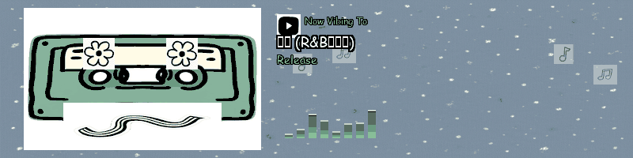
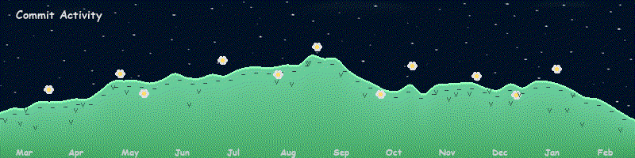

<!-- ═══════════════════════════════════════════════════════════════ -->
<!-- HEADER — white → mint gradient waving                        -->
<!-- ═══════════════════════════════════════════════════════════════ -->

  

<!-- ═══════════════════════════════════════════════════════════════ -->
<!-- TYPING SVG — works on both light AND dark GitHub themes       -->
<!-- ═══════════════════════════════════════════════════════════════ -->
<h4 align="center">
  <a href="https://github.com/zw-g">
    <picture>
      <source media="(prefers-color-scheme: dark)" srcset="https://readme-typing-svg.demolab.com/?lines=Hi+there+%F0%9F%91%8B+welcome+to+my+Github!;I'm+a+Software+Engineer+%40+Meta;Core+Feed+Ranking+%E2%80%A2+passionate+about+Automation;Exploring+ML+%26+LLM+Agents+%F0%9F%8C%B1&font=Comic+Neue&center=true&width=520&height=45&color=90EE90&vCenter=true&pause=2000&size=18&duration=2500" />
      
    </picture>
  </a>
</h4>

<!-- ═══════════════════════════════════════════════════════════════ -->
<!-- ORIGINAL ALIEN GIF — the professional one Papa loves          -->
<!-- ═══════════════════════════════════════════════════════════════ -->

  

<!-- ═══════════════════════════════════════════════════════════════ -->
<!-- INTRO TEXT                                                      -->
<!-- ═══════════════════════════════════════════════════════════════ -->

  <samp>Hi there 👋 welcome to my Github! I'm a Software Engineer @ Meta Core Feed Ranking team passionate about Automation.</samp>

<!-- ═══════════════════════════════════════════════════════════════ -->
<!-- SOCIAL ICONS — all skillicons.dev for consistency              -->
<!-- ═══════════════════════════════════════════════════════════════ -->

  &nbsp;
  &nbsp;
  &nbsp;
  &nbsp;
  

<!-- ═══════════════════════════════════════════════════════════════ -->
<!-- MORE ABOUT ME                                                  -->
<!-- ═══════════════════════════════════════════════════════════════ -->

<samp> more about me 🌼 </samp>

#

<!-- BIO -->

  - 🧑🏻‍💻 My name sounds like **Jaw-Way**
  - 🎓 I've graduated with BS in **Technology Information Management** & MS in **Software Development**
  - 🔭 I'm currently working on **Facebook Feed Ranking** @ Meta
  - 🌱 I'm currently exploring **Machine Learning**, **LLM Agents**, and AI-powered automation
  - 🤔 My career interests lie in building innovative products that enrich people's everyday experiences.

 

<!-- ─────────────── WEATHER ─────────────── -->

<!-- WEATHER:START -->

<table>
<tr>
<td align="center" width="160">
 
<strong>64°F</strong> 
Clear sky 
Feels like 61°F
</td>
<td align="left">
<strong style="font-size:1.1em">📍 Menlo Park, CA</strong> 
💨 Wind: 6 mph · 💧 Humidity: 43% 
🌡️ High: 88°F · Low: 58°F  
<strong>3-Day Forecast:</strong> 

Tue: ☀️ 88°F / 58°F · 
Wed: ☀️ 88°F / 58°F · 
Thu: ☀️ 86°F / 62°F
 
<i>Updated: Tue Mar 17, 12:57 AM PDT</i>
</td>
</tr>
</table>

<!-- WEATHER:END -->

<!-- ─────────────── MUSIC (full-width) ─────────────── -->

  

<!-- ─────────────── LANGUAGES & TOOLS ─────────────── -->

<h4 align="center">🌿 Languages & Tools</h4>

  

<!-- ─────────────── AI / ML ─────────────── -->

<h4 align="center">✨ AI / ML</h4>

  &nbsp;&nbsp;
  &nbsp;&nbsp;
  &nbsp;&nbsp;
  

<!-- ─────────────── COMMIT ACTIVITY (full-width) ─────────────── -->

  

<!-- ─────────────── CODE CYCLE ─────────────── -->

  **Code Cycle**

  
  &nbsp;&nbsp;&nbsp;&nbsp;&nbsp;
  
  &nbsp;&nbsp;&nbsp;&nbsp;&nbsp;
  

<!-- ═══════════════════════════════════════════════════════════════ -->
<!-- FOOTER                                                         -->
<!-- ═══════════════════════════════════════════════════════════════ -->

  

