<!-- ═══════════════════════════════════════════════════════════════ -->
<!-- HEADER — white → mint gradient waving                        -->
<!-- ═══════════════════════════════════════════════════════════════ -->

  

<!-- ═══════════════════════════════════════════════════════════════ -->
<!-- TYPING SVG — works on both light AND dark GitHub themes       -->
<!-- ═══════════════════════════════════════════════════════════════ -->
<h4 align="center">
  <a href="https://github.com/zw-g">
    <picture>
      <source media="(prefers-color-scheme: dark)" srcset="https://readme-typing-svg.demolab.com/?lines=Hi+there+%F0%9F%91%8B+welcome+to+my+Github!;I'm+a+Software+Engineer+%40+Meta;Core+Feed+Ranking+%E2%80%A2+passionate+about+Automation;Exploring+ML+%26+LLM+Agents+%F0%9F%8C%B1&font=Comic+Neue&center=true&width=520&height=45&color=90EE90&vCenter=true&pause=2000&size=18&duration=2500" />
      
    </picture>
  </a>
</h4>

<!-- ═══════════════════════════════════════════════════════════════ -->
<!-- ALIEN + WEATHER GLOBE — side by side on landing page          -->
<!-- ═══════════════════════════════════════════════════════════════ -->

  

<!-- ═══════════════════════════════════════════════════════════════ -->
<!-- INTRO TEXT — visible in both themes                            -->
<!-- ═══════════════════════════════════════════════════════════════ -->

  <samp>Hi there 👋 welcome to my Github! I'm a Software Engineer @ Meta Core Feed Ranking team passionate about Automation.</samp>

<!-- ═══════════════════════════════════════════════════════════════ -->
<!-- SOCIAL ICONS — colorful via skillicons.dev (works dark+light) -->
<!-- ═══════════════════════════════════════════════════════════════ -->

  
  
  
  
  

<!-- ═══════════════════════════════════════════════════════════════ -->
<!-- MORE ABOUT ME                                                  -->
<!-- ═══════════════════════════════════════════════════════════════ -->

<samp> more about me 🌼 </samp>

#

<!-- BIO -->

  - 🧑🏻‍💻 My name sounds like **Jaw-Way**
  - 🎓 I've graduated with BS in **Technology Information Management** & MS in **Software Development**
  - 🔭 I'm currently working on **Facebook Feed Ranking** @ Meta
  - 🌱 I'm currently exploring **Machine Learning**, **LLM Agents**, and AI-powered automation
  - 🤔 My career interests lie in building innovative products that enrich people's everyday experiences.

 

<!-- ─────────────── LANGUAGES & TOOLS ─────────────── -->

<h4 align="center">🌿 Languages & Tools</h4>

  

<!-- ─────────────── AI TOOLS ─────────────── -->

<h4 align="center">✨ AI</h4>

  
  
  
  
  

 

<!-- ─────────────── CONTRIBUTION GRAPH ─────────────── -->

  <picture>
    <source media="(prefers-color-scheme: dark)" srcset="https://github-readme-activity-graph.vercel.app/graph?username=zw-g&bg_color=0D1117&color=90EE90&title_color=90EE90&line=90EE90&point=FFD700&area=true&area_color=90EE90&hide_border=true&radius=12" />
    
  </picture>

<!-- ─────────────── CODE CYCLE ─────────────── -->

  **Code Cycle**

  
  &nbsp;&nbsp;&nbsp;&nbsp;&nbsp;
  
  &nbsp;&nbsp;&nbsp;&nbsp;&nbsp;
  

<!-- ═══════════════════════════════════════════════════════════════ -->
<!-- FOOTER                                                         -->
<!-- ═══════════════════════════════════════════════════════════════ -->

  

